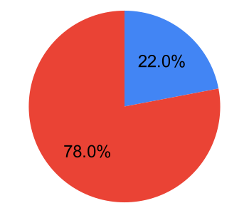
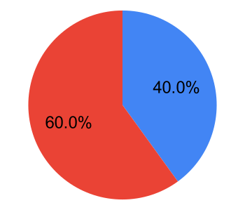

# C++ Should Be C++

<br><br><br><br>

D3023R1  
David Sankel, Adobe  

--

## Acknowledgments

<div class="container">
<div class="col" data-markdown>

**Papers**
- Direction for ISO C++ (P2000R4)
- Thriving in a Crowded and Changing World
- How can you be so certain? (P1962R0)
- Operating principles for evolving C++ (P0559R0)
</div>

<div class="col" data-markdown>

**Feedback**
- Niall Douglas
- Inbal Levi
- Bjarne Stroustrup
- Herb Sutter
</div>
</div>

--

### Reflector discussion

<div class="container">
<div class="col" data-markdown>

- Axel Naumann
- Balog Pal
- Corentin Jabot
- Harald Achitz
- Howard Hinnant
- Jarrad Waterloo
- JF Bastien
</div>

<div class="col" data-markdown>

- Oliver Hunt
- Patrice Roy
- Peter Dimov
- René Ferdinand Rivera Morell
- Ville Voutilainen
</div>
</div>

--

## It's been a tough couple years.

Note: pandemic, outrage in C++ communities, world events

--

## Questions raised

- What is the point of our work? <!-- .element: class="fragment" data-fragment-index="1" -->
- Why is it worthwhile? <!-- .element: class="fragment" data-fragment-index="2" -->
- What should we be doing? <!-- .element: class="fragment" data-fragment-index="3" -->
- What are our obstacles? <!-- .element: class="fragment" data-fragment-index="4" -->

--

Goal: <span style="color:red">**start a conversation**<span>

---

"if we are not careful, C++ can still fail"

"[principles are needed] to keep C++ alive, healthy and progressing" <!-- .element: class="fragment" data-fragment-index="1** -->

--

## What can C++ loose?
<br><br>

### <span style="color:red">**utility**</span> <!-- .element: class="fragment" data-fragment-index="1" -->
<br>

*Observation 1: other programming languages cannot "take away" C++'s utility* <!-- .element: class="fragment" data-fragment-index="2" -->

*Observation 2: legislation cannot reduce C++'s capabilities* <!-- .element: class="fragment" data-fragment-index="3" -->

Note: Other tools can make C++ more useful, but never less. Legislation may change the problems that people want to solve, but it doesn't change the set of problems C++ can solve.

--

## So what can threaten C++'s utility?


### <span style="color:red">**us**</span> <!-- .element: class="fragment" data-fragment-index="1" -->

*backwards compatibility mitigates this* <!-- .element: class="fragment" data-fragment-index="2" -->

--

*The surest way to sabotage a standard is to say yes to everything*

<br>

"[a complex mess of incoherent ideas becomes] insanity to the point of endangering the future of C++" <!-- .element: class="fragment" data-fragment-index="1" -->

Note: hammer analogy

--

How do we mitigate this risk and align the committee to a greater good?

---

# Mission

--

## Some not-so-great missions

1. Make/keep C++ the best language in the world
2. Make C++ the only language people use
3. Make C++ the most popular language

Note: "best" is questionable. Impact is 

--

## Consequences of this line of thought

- **Misalignment.** "competing" tools good for users, but bad for mission
- **Ignorance.** Why investigate when we're the best?

--



22% of C++ users are also using Rust

--



40% of C++ users want to use Rust

--

*Ignorance of Rust is ignorance of our users.*

We need a more helpful mission <!-- .element: class="fragment" data-fragment-index="1" -->

--

## A mission: _improve people's lives_

<br><br>

```C++
for(const auto & i: vec) { // "Ah, that's nice!" x 5,000,000
   f(i);
}
```
<!-- .element: class="fragment" data-fragment-index="1" -->


--

<!-- .slide: data-background="#FFFFFF" -->


---

## Social obstacles to overcome

--

### C++ as a personal and group identity

*What language do *you* program in?*

- Clouds reason <!-- .element: class="fragment" data-fragment-index="1" -->
- Deep seated fears <!-- .element: class="fragment" data-fragment-index="2" -->

--

### Counterproductive rhetoric

*fatal, fail, dead, and death*

- Living things have finite resources (users), competition (other languages), and death (obsolescence)<!-- .element: class="fragment" data-fragment-index="1" -->
- C++ is merely a tool that is sometimes useful! <!-- .element: class="fragment" data-fragment-index="2" -->
- Idea of "enemy" frustrates cooperation <!-- .element: class="fragment" data-fragment-index="3" -->

--

> "I can think of few things more depressing than people still using C++ in a million years" - Lisa Lippincott

- -5,000,000: first homininans <!-- .element: class="fragment" -->
- -300,000: first homo sapians <!-- .element: class="fragment" -->
- -40,000: last non-sapian hominan died out <!-- .element: class="fragment" -->
- -12,000: agriculture <!-- .element: class="fragment" -->
- -5,000: writing <!-- .element: class="fragment" -->
- -500: modern English <!-- .element: class="fragment" -->
- -78: first computer <!-- .element: class="fragment" -->
- -38: first C++ release <!-- .element: class="fragment" -->

--

### Personal opportunity vs. stewardship

*Gain C++ expertise, mingle with celebrities, land a proposal!*


--

### Some numbers

- 5,000,000 C++ users
- About the population of Ireland
- \>1 C++ programmer for every 2,000 people

<br>
<br>

*"we are writing a standard for millions of programmers to rely on for decades, a bit of humility is in order"* <!-- .element: class="fragment" -->

--

No one is qualified for this

--

### Stewardship responsibilities

- Reject proposals without understandable value proposition
- Resist social pressure when you're against something
- Build an informed opinion (read the paper, test the feature, collaborate)
- Say "yes" only when risk is minimal

*You are a caretaker and guardian of something beyond yourself!*

--

### If you're writing a proposal, consider...

- "[C++ is] trying to do too much too fast"
- "[C++ needs] to become more restrained and selective"
- Experience reports on high-impact proposals are more helpful than low-impact
  proposal papers
- Help is available

---

## Technical obstacles to overcome

--

### Neophilia

<!-- .slide: data-background="#FFFFFF" -->


Note: Gartner Hype Cycle

--

## Neophilia risks

- Failed expectations
- Poor integration
- Non-expert frustration with learning costs

*"Keeping up with the Jonses is a disservice"* <!-- .element: class="fragment" -->

--

## Expert bias

- **Underrepresentation** of average programmers in committee
- **Opportunity cost** of expert features is improving lives at scale
- **Expert friendly** means smaller impact

--

## Know your numbers

--

| Query                       | # files | %         |
|-----------------------------|---------|-----------|
| \*                          | 34.6M   | 100%      |
| cout                        | 9M      | 26%       |
| int main(                   | 8.3M    | 24%       |
| std::vector                 | 4.7M    | 14%       |
| std::unordered\_map         | 692k    | 2.0%      |
| std::sort                   | 379k    | 1.1%      |

--

| Query                       | # files | %         |
|-----------------------------|---------|-----------|
| \*                          | 34.6M   | 100%      |
| #include \<thread\>         | 281k    | 0.81%     |
| std::integral_constant      | 5.6k    | 0.016%    |
| std::pmr                    | 1.7k    | 0.0049%   |
| hazardptr OR hazard\_ptr    | 848     | 0.0025%   |
| std::launder                | 278     | 0.00080%  |
| std::atomic<std::shared_ptr | 42      | 0.000121% |

--

## Get average engineer feedback

- Is this something you would use? How often?
- Is this ergonomic?
- How hard is this to learn?
- Is this worth another chapter in the C++ book?

--

## Complexity

--

## Complexity: hiring impact

- Barrier to entry is too high
- Fewer people want to learn C++ and fewer schools want to teach it

--

“C++ [is] in danger of losing coherency due to proposals based on differing and
sometimes mutually contradictory design philosophies and differing stylistic
tastes.”

- `std::function` -> `std::copyable_function`, `std::function_ref`, and `std::move_only_function`
- Preference for new tagged/named parameters over simple classes
- Recent proposals contradicting Stephanov's regular concept
- ...

--

## Aim for coherence

- "Is this the common C++ style?" "Is this increasing C++'s barrier to entry?"
- Have study groups get early feedback from evolution groups on feature desirability
- Overcome reluctance to say "I don't think this belongs in C++"

--

## Prioritize well

- Don't deny the greater number of users time spent on proposals that can
  improve their lives.
- Avoid pet peeves
- Say "no" more often and, if needed, repeatedly

Note: `indirect<T>` and `polymorphic<T>`. Jonathan Coe, Antony Peacock, Sean Parent

---

## Opinions on moving ahead

--

## Memory safety

- We're near the peak of inflated expectations
- 1.6% of CMake projects mention `fsanitize`
- There are 31 Rust projects for each of these

--

## Memory safety - dangers

- Opportunity cost
- Assuming complexity and incoherence trying to "keep up"
- Missing out on memory-safe language interop

--

## Major C++ overhaul

- So-called successor languages?
- C++ 2.0

--

## C++ 2.0

- New syntax isn't a priority for typical C++ developers
- Users desire coherence in their C++ code bases
- We aren't especially suited to make a C++ successor

--

### Our biggest opportunity to improve people's lives:

## Focus on C++ as it is today

--

## Some examples

--

### Command-line processing library

- 3.2% of GitHub C++ source files use a command-line parser library
- 2.0% of GitHub C++ source files *manually* parse the command line
- Manual command-line parsing is as popular as `std::unordered_map`
- This could easily impact a million lives

Note: [search](https://github.com/search?type=code&auto_enroll=true&q=argv%5B+path%3A*.cpp+NOT+%22char+*argv%5B%22+NOT+%22char*+argv%5B%22+NOT+%22char+*+argv%5B%22+NOT+%22const+argv%5B%22)

--

### Simple JSON library

- 2.9% of GitHub C++ source files mention JSON (0.2% for YAML and 3.5% for XML)
- Consider the number of custom formats replaced with JSON

--

### Hash containers

- New techniques produce 2-6x speedups
- Require API changes
- Considerable energy/environmental impact

Note: [link](https://martin.ankerl.com/2019/04/01/hashmap-benchmarks-03-01-result-InsertHugeInt/)

--

### There are many others...

--

## C++ Should Be C++

- Mission: improve people's lives
- Stewardship
- Technical obstacles: neophilia, expert bias, complexity/coherence
- Focus on broad improvements like range-based for loops

*Let's discuss!*
